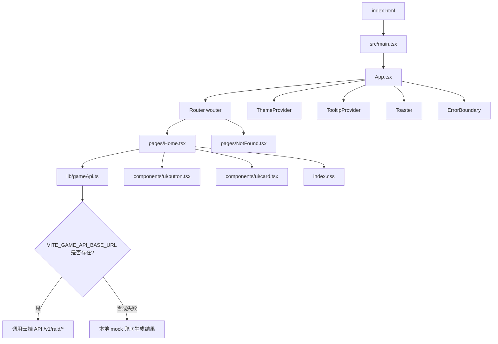
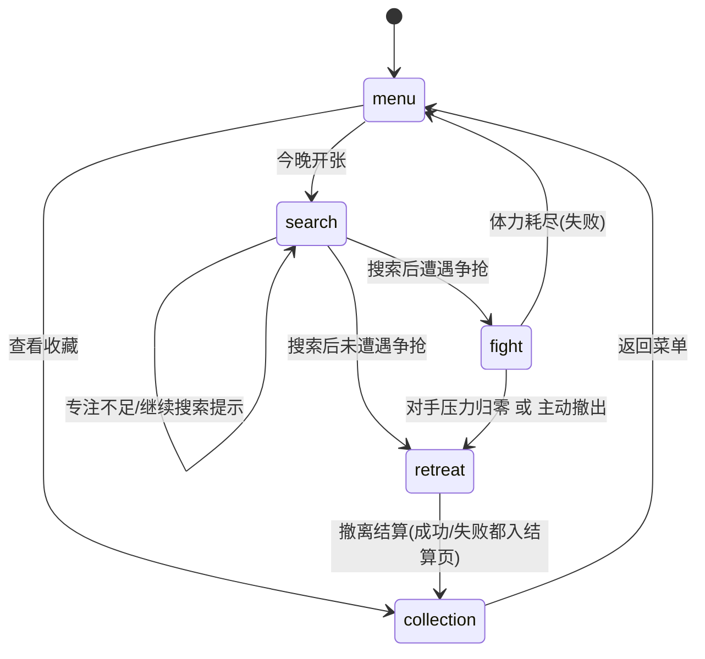
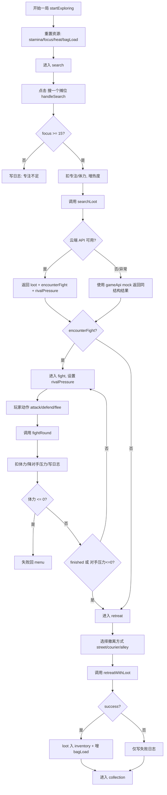
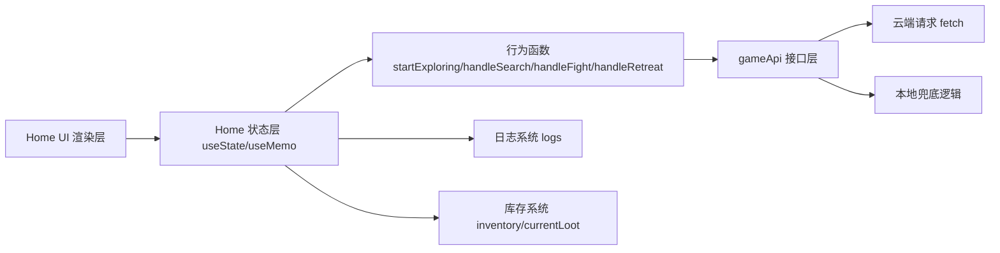
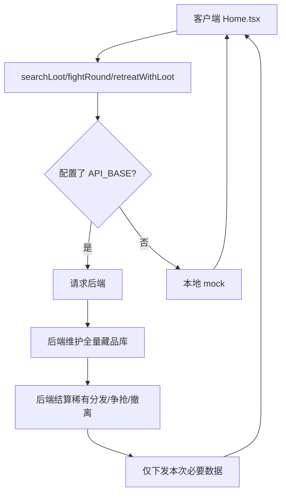

# 项目逻辑图（交互 + 代码）

本文档基于当前代码实现整理，覆盖：

- 代码架构逻辑
- 交互状态流转
- 单局核心流程
- 云端 API + 本地兜底策略
- 关键状态和数据关系

---

## 1) 代码架构逻辑图

---

## 2) 交互状态机（玩家视角）

---

## 3) 单局核心流程图（交互 + 代码）

---

## 4) 代码职责分层图

---

## 5) 云端分发与安全逻辑图

---

## 6) 关键类型与状态清单

- `GameState`: `menu | search | fight | retreat | collection`
- 核心资源：`stamina`、`focus`、`heat`、`bagLoad`、`rivalPressure`
- 藏品结构：`Loot { id, name, rarity, value, icon, district }`
- API 返回结构：
  - `SearchResult`
  - `FightResult`
  - `RetreatResult`

